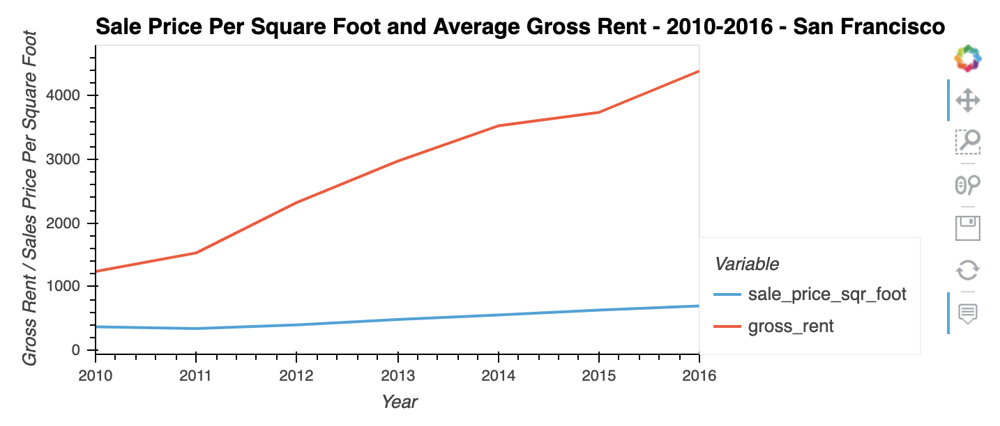
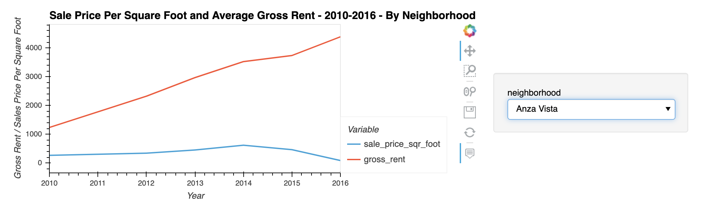
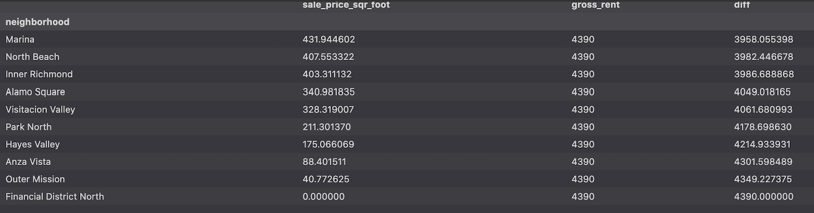
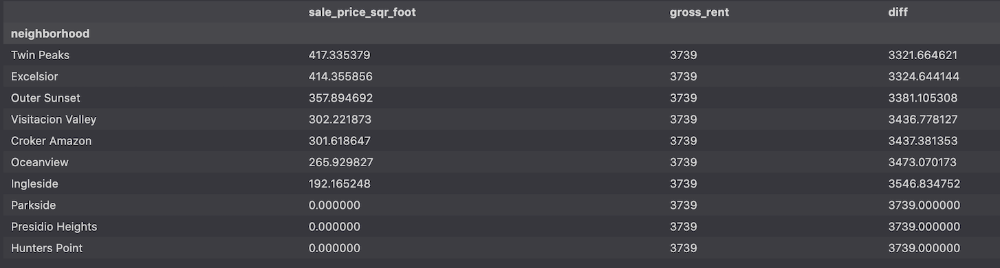
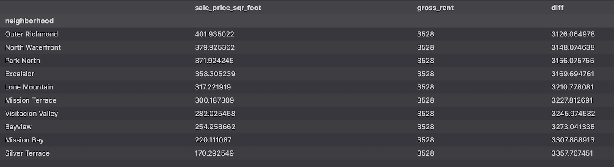
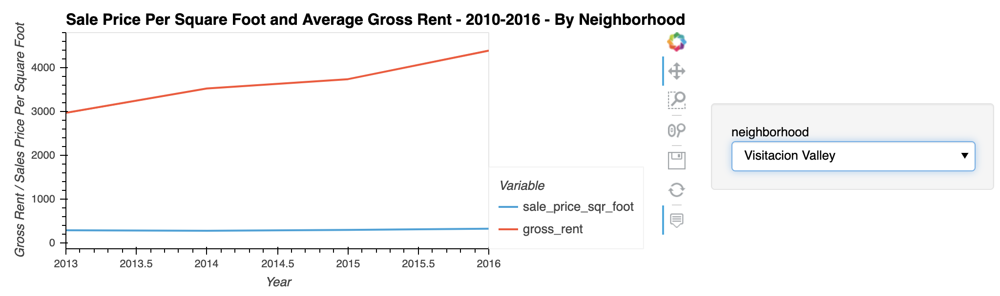
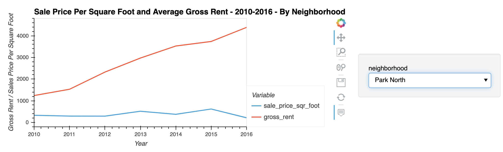
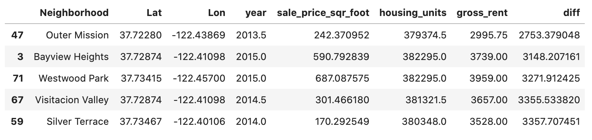
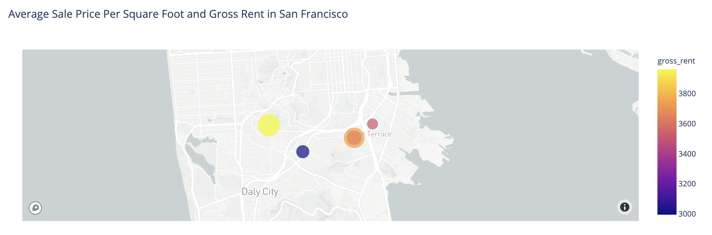

# Real Estate Analysis 

This project attempts to analyze the San Francisco real-estate market for potential investment opportunities.

---

## Technologies

This project leverages python 3.7.9 with the following packages:

* [pandas](https://pandas.pydata.org/docs/) - For the analysis of the real estate market.

* [matplotlib](https://matplotlib.org/) - For the visualization of real estate information.

* [ploty.express](https://plotly.com/python/plotly-express/) - For the visualization of real estate information.

* [hvplot.pandas](https://hvplot.holoviz.org/user_guide/Introduction.html) - For the visualization of real estate information.

On the terminal, under the conda dev environment, install the following:

---

## Installation Guide

Before running the application first install the following dependencies.

```
  pip install pandas
```

---

## Usage

This project needs access to your .env variables where you should store your MAPBOX_API_ACCESS_TOKEN.
To obtain these keys go to [mapbox](https://www.mapbox.com/) and sign-up for a free account.

---

## Analysis

For the most part the trend for rental income growth and sales price are both increasing, however, the rental income is increasing at a much faster rate over the 2010-2016 timeframe that we analyzed, as can be seen below.



However, for a few neighborhoods, for the last few years, the the sales price has slowly decreased. We will look more into the specific areas and neighborhoods below.



There are a few neighborhoods where the company might want to explore the possibility of implementing its one-click, buy-and-rent strategy. These neighborhoods would include places where the gross rent has continued to rise but where the sales price per square foot has slightly decreased.

We can find possible neighborhoods where we want to explore this strategy more in two ways.

1. By looking at the sales price per square foot compared to the gross rent by neighborhood by year.
2. By looking at the average price per square foot compared to the average gross rent over our entire 2010-2016 timeframe.

If we just quickly filter our table to look at the difference between gross rent and square foot by year by neighborhood we find the following.

#### For 2016:

#### For 2015:

#### For 2014:


We can quickly see that maybe we are missing a little bit of data for a few neighborhoods where we have a sales price per square foot of zero such as for Financial District North for the year 2016. So, we will just throw those points out or look into they futher to figure out the problem.

If we just focus on the neighborhoods that have appeared on the these lists over multiple years, i.e. the difference between the sales price and gross rent has been increasing over multiple years, then we should focus on the Visitacion Valley and Park North Neighborhoods. Looking at their graphs we see the following.

#### Visitacion Valley Neighborhood:

#### Park North Neighborhood:


We can see that the sales price has stayed constant or decreased over the years, thus making the difference between gross rent and sales price greater than other neighborhoods. Thus, we might want to focus more on these or similar neighborhoods.

Taking our analysis in a slightly different direction we can look at the difference between our average price per square foot compared to the average gross rent over our entire 2010-2016 timeframe.

By quickly doing this filter we get the following table:



Again, we can see that the Visitacion Valley neighborhood made it into this table as well. Another indicator that we should look at this neighborhood more closely.

Finally, plotting the previous table on a map we find that the top 5 neighborhoods, i.e. with the greatest difference between gross rent and sales price, seem to be located in the southern part of SF. Thus, we might also want to focus our attention on the southern area of SF in general.



---

## Contributors

Nathan Patterson

---

## License

MIT
